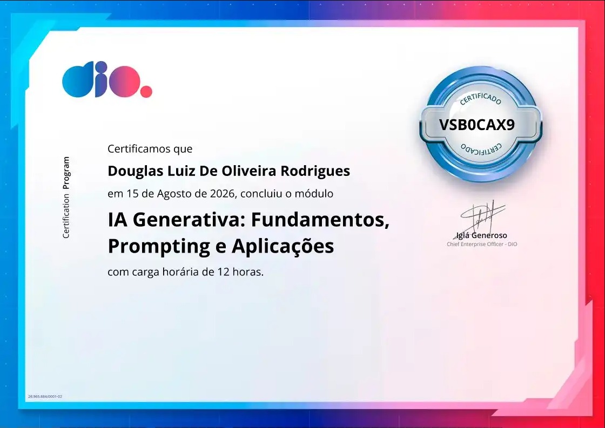

# 01.0 IA Generativa: Fundamentos, Prompting e Aplicações

Módulo focado no entendimento conceitual de Inteligência Artificial, Modelos de Linguagem de Grande Escala (LLMs), Engenharia de Prompts e aplicações práticas.

---

## 🎓 Certificação do Módulo

| Módulo | Carga Horária | Conclusão | Código de Validação |
| :--- | :---: | :---: | :---: |
| **IA Generativa: Fundamentos, Prompting e Aplicações** | 12h | 15/08/2026 | `VSB0CAX9` |

  

## 01.1 Boas vindas ao Bootcamp Bradesco - GenAI, Dados & Cyber

* **Status:** 🟢 Concluído

### 📌 Conteúdo Estudado:
* **Apresentação da Trilha:** Visão geral do programa de formação em IA, Dados e Cibersegurança do Bradesco em parceria com a DIO.
* **Mercado & Oportunidades:** Contextualização sobre as vagas na área tech (como Engenharia de Software, Dados e IA) e o perfil profissional buscado pelas empresas.
* **Estrutura do Bootcamp:** Como utilizar a plataforma, acompanhar as aulas e desenvolver os projetos para construir um portfólio relevante para o mercado.

---

## 01.2 Fundamentos da IA Moderna: Machine Learning, LLMs, IA Generativa e Agentes

* **Status:** 🟢 Concluído

### 📌 Conteúdo Estudado:
* **Como a Inteligência Artificial Nasceu:** A evolução histórica da IA, desde os conceitos fundamentais e sistemas baseados em regras até a ascensão do Machine Learning.
* **Treinamento de IA e O que são LLMs:** Como os modelos de linguagem são treinados com grandes volumes de dados (pré-treinamento e ajuste fino) e a função das Large Language Models no ecossistema moderno.
* **Entendendo Deep Learning:** A estrutura das redes neurais profundas, como os dados são processados em camadas e a importância dessa arquitetura para o avanço do aprendizado de máquina.
* **A Era das IAs Generativas:** O salto tecnológico dos modelos preditivos para os modelos geradores (texto, imagem e código) e o surgimento do conceito de Agentes Autônomos.

---

## 01.3 Fundamentos de Modelos de Linguagem de Grande Escala

* **Status:** 🟢 Concluído

### 📌 Conteúdo Estudado:
* **Principais Características dos LLMs:** Análise das capacidades de generalização das Large Language Models e exploração prática do comportamento desses modelos diante de diferentes tarefas.
* **Desafios no Desenvolvimento:** Estudo das limitações técnicas das LLMs (como alucinações, janela de contexto e viés) e estratégias hands-on para mitigar esses problemas.
* **Aplicações Práticas:** Casos de uso do mercado e implementação prática de LLMs aplicada a cenários como E-commerce e atendimento ao cliente.
* **Impacto na Sociedade e Mercado:** Análise crítica do impacto dos modelos de linguagem no mercado de trabalho moderno e o papel da IA na transformação digital das empresas.

---

## 01.4 Introdução à Engenharia de Prompts

* **Status:** 🟢 Concluído

### 📌 Conteúdo Estudado:
* **Fundamentos da Engenharia de Prompts:** Entendimento de por que a Engenharia de Prompts é uma habilidade crucial e visão geral de como as LLMs interpretam as instruções fornecidas.
* **Mecanismos de Atenção e Memória:** Como os modelos de linguagem "entendem" uma instrução e "mantêm a memória" (contexto) ao longo de uma interação.
* **Elementos Essenciais de um Prompt:** Estruturação de instruções claras, definição de papéis (roles), contextualização e especificações de formato para respostas precisas.
* **Aplicações e Boas Práticas no Dia a Dia:** Utilização prática no ambiente corporativo, boas práticas de escrita e os principais cuidados/limitações no uso de prompts.

---

## 01.5 Técnicas de Engenharia de Prompt

* **Status:** 🟢 Concluído

### 📌 Conteúdo Estudado:
* **Construção e Estrutura de Prompts:** Análise detalhada dos componentes fundamentais (Instrução, Contexto, Dados de Entrada e Indicadores de Saída) para garantir previsibilidade e precisão nas respostas.
* **Técnicas Avançadas:** Aplicação de padrões como *Zero-shot*, *Few-shot Prompting* (uso de exemplos), *Chain-of-Thought* (Cadeia de Pensamento) e especificação de personas/papéis.
* **Refinamento e Clareza:** Estratégias para redução de ambiguidades, restrição de escopo e técnicas de formatação (Markdown, JSON e listas) para integração com outros sistemas.
* **Otimização para Casos Reais:** Testes práticos para ajustar o tom, estilo, nível de detalhamento e limites de tokens da resposta gerada.

---

## 01.6 Desafios de Projetos: Crie Um Portfólio Vencedor

* **Status:** 🟢 Concluído

### 📌 Conteúdo Estudado:
* **Metodologia PBL (Project-Based Learning):** Aplicação prática da aprendizagem baseada em projetos para a construção de soluções reais e desenvolvimento de competências técnicas exigidas pelo mercado.
* **Construção de Portfólio & Empregabilidade:** Estratégias para estruturar projetos no GitHub de forma profissional, destacando habilidades técnicas e resolução de problemas para atrair recrutadores.
* **Desafios de Projeto na Prática:** A relevância de transformar conceitos teóricos de IA e desenvolvimento em repositórios documentados, organizados e prontos para demonstração em entrevistas.

---

## 01.7 Desafio de Projeto: Treinando uma IA de Aprendizagem com NotebookLM

* **Status:** 🟢 Concluído

### 📌 Conteúdo Estudado e Prática:
* **Exploração do Google NotebookLM:** Estudo da arquitetura do NotebookLM como uma ferramenta assistiva grounded (baseada em fontes de dados específicas) para potencializar o aprendizado contínuo.
* **Curadoria e Ingestão de Fontes:** Mapeamento, seleção e organização de documentos, PDFs e notas técnicas para alimentação da base de conhecimento da IA.
* **Construção do Ambiente de Aprendizagem:** Criação prática do notebook, configuração das fontes e análise dos formatos de saída do estúdio (resumos automáticos, guias de estudo e perguntas e respostas).
* **Entrega do Projeto:** Estruturação da solução e aplicação prática da IA generativa como um mentor/assistente de estudos personalizado.

---